Adding the game to Steam (Optional)
===================================

-  1.    Open up Steam, then click **"ADD A GAME"** at the bottom left,
   then Add a **"Non-Steam Game…"**

| 
| |image139|
| |image140|

-  2.    In the window that pops up, click **"BROWSE…"**

| 
| |image141|

-  3.    Then click This PC on the left
-  a.    Then double click your C drive.
-  b.    Then double click Emulation.
-  c.    Then double click PCSX2.
-  d.    Then double click pcsx2-qt.exe .

| 
| |image142|
| |image143|
| |image144|
| |image145|
| |image146|

-  4.    You’ll now have a pcsx2-qt item in your list with a check box,
   click **"ADD SELECTED PROGRAMS."**

| 
| |image147|

-  5.    Go to your library and find pcsx2, then right click, and click
   **"Properties…"**

| 
| |image148|
| |image149|

-  6.    Change the name to say Persona 3 FES, and change the launch
   options to ``-- "C:\Emulation\MOD\Persona 3 FES.ELF"`` (or whatever
   else you may have named it as)

| 
| |image150|
| |image151|

-  7.    To change the icon, click the PS2 icon, then navigate to an
   icon of your choosing, for getting an actual icon however, that will
   be out of the scope of this guide. You can grab a few icons from `here <https://www.steamgriddb.com/game/35402/icons>`.
   If you want the one this site uses, you can grab it `here <_static/favicon.png>`.

| 

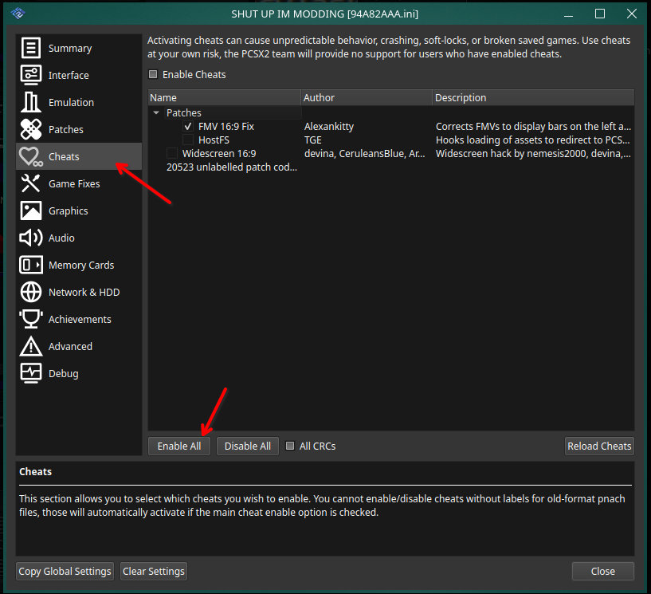
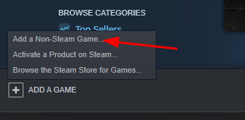
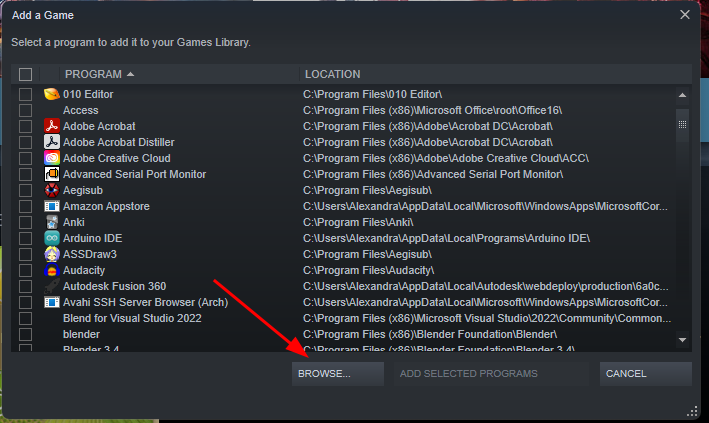
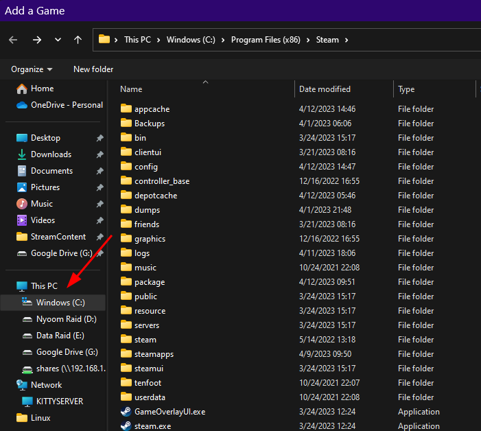
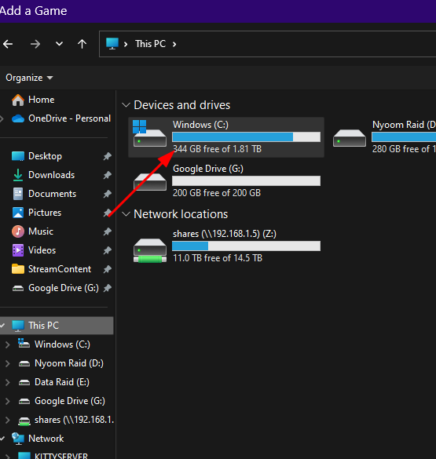
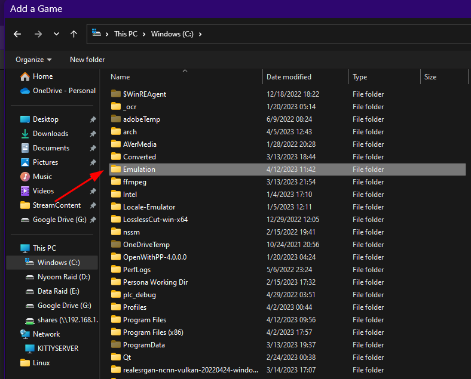
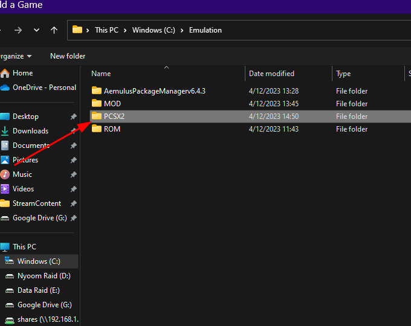
.. |image146| image:: images/146.png
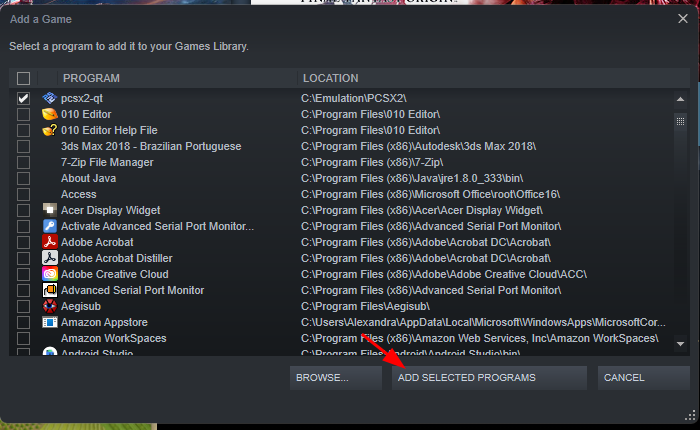
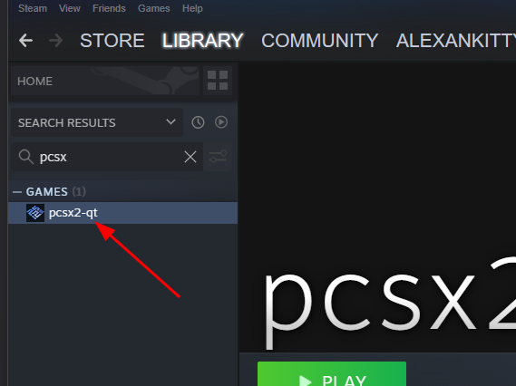
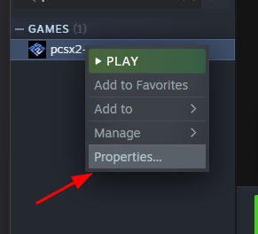
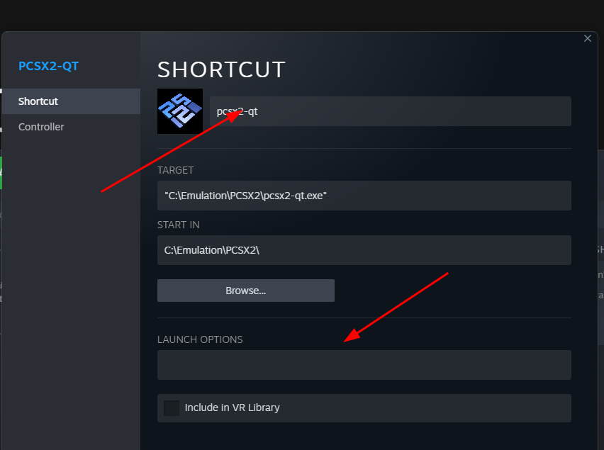
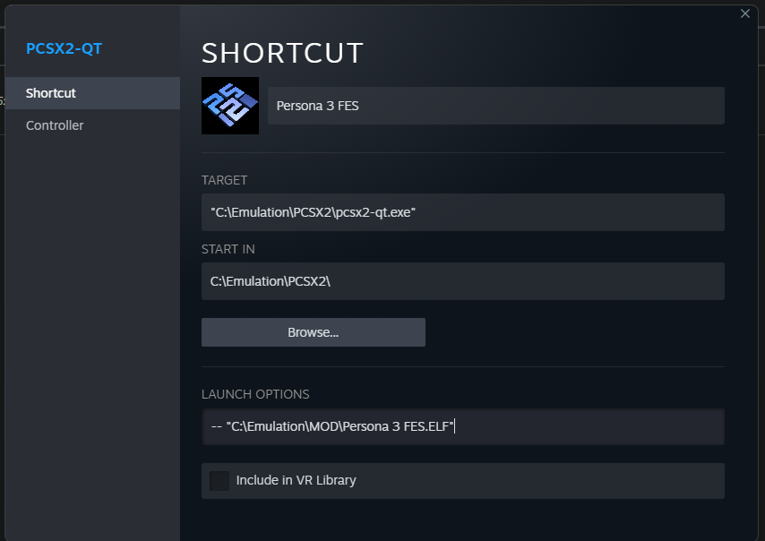
