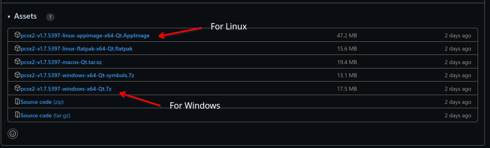
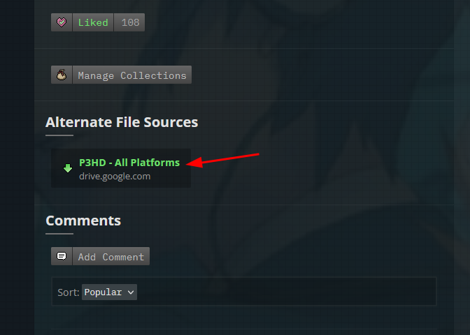
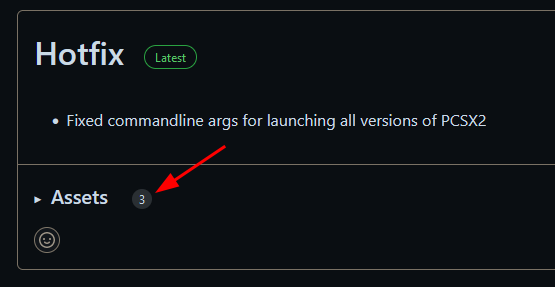
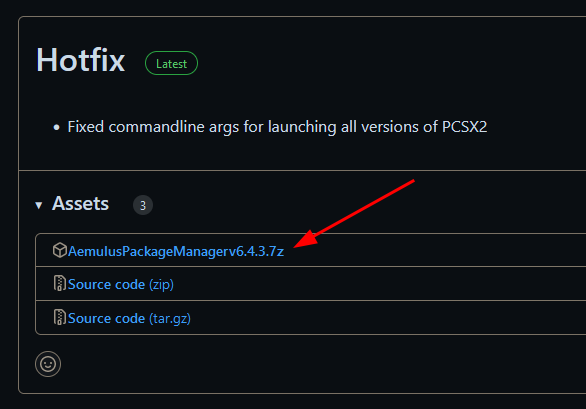
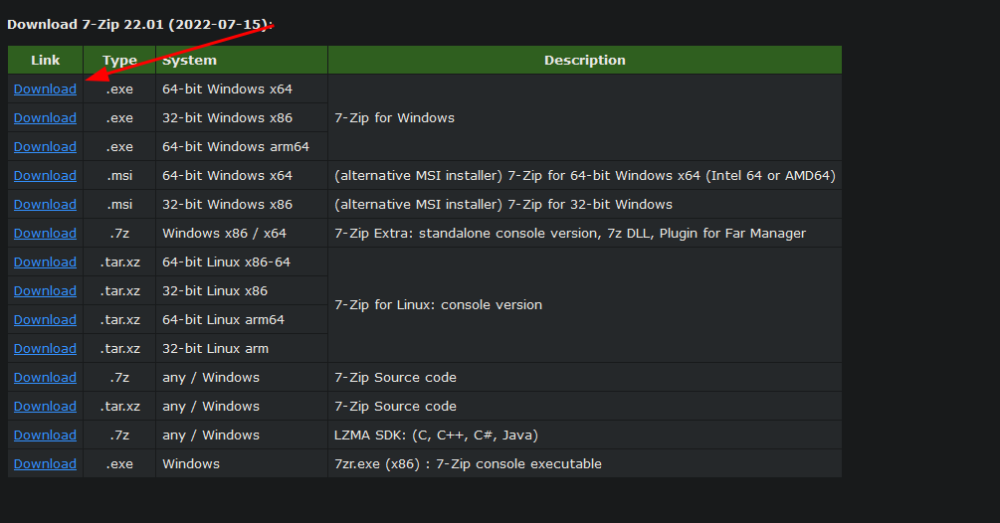

Downloading PCSX2, P3HD, Aemulus, and 7-Zip
============================================

PCSX2
-----

| 
| Click the Latest PCSX2 Nightly Build under Requirements, or click
  `here <https://github.com/PCSX2/pcsx2/releases/tag/v1.7.5397>`__.

#. Click **"Latest Nightly"**
#. Then click the version that matches your OS. For most people this
   will be the first option for Windows. For Linux you will want the one ending in Appimage.

| |image1|

Persona 3 FES: HD Overhaul
--------------------------

| 

#. Click Persona 3 HD under Requirements, or click
   `here <https://gamebanana.com/wips/63624>`__.
#. Scroll down to Alternate File Sources.
#. Click **"P3HD – All Platforms."**

| |image2|

Aemulus
-------

.. .. note::
   If you're running on Linux you can skip this part.

#. Click Latest Aemulus Release under Requirements, or click
   `here <https://github.com/TekkaGB/AemulusModManager/releases>`__.
#. Find the first **"Assets"** header and click to expand it
#. Then grab the item named **"AemulusPackageManagervx.x.x.7z."**

| |image3|
| |image4|

7-Zip
-----

#. Click 7-Zip under Requirements, or click
   `here <https://www.7-zip.org/download.html>`__.
#. Select the 64-bit Windows x64 **"Download"** option.

| |image5|

