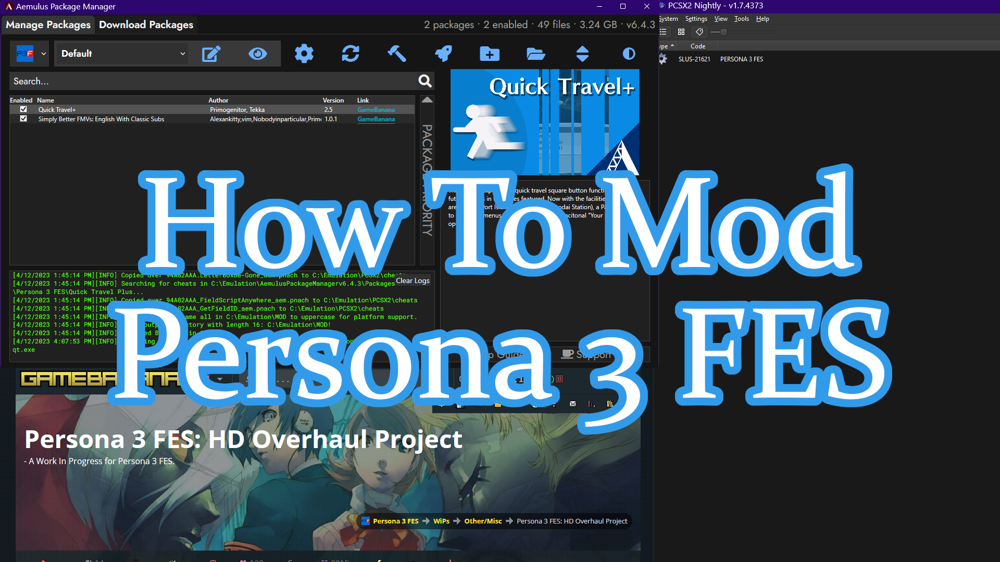

How To Mod Persona 3 FES!
=========================

The purpose of this guide is to help anyone be able to mod Persona 3 FES for the PS2.

Requirements
------------
- `Latest PCSX2 Nightly Build <https://pcsx2.net/downloads>`_
- `Persona 3 FES: HD Overhaul (Recommended) <https://gamebanana.com/wips/63624>`_
- `Recommended list of mods (Dub/English Audio) <https://gamebanana.com/collections/376>`_
- `Recommended list of mods (Undub/Japanese Audio) <https://gamebanana.com/collections/380>`_
- `Latest Aemulus Release <https://github.com/TekkaGB/AemulusModManager/releases>`_
- `7-Zip <https://www.7-zip.org/download.html>`_
- Approximately 6GB of free space. 1GB if you're not using P3HD.
- Unpatched/Clean Persona 3 FES ISO with CRC 94A82AAA
- USA/NTSC-U PS2 BIOS

.. note::

   This doc is in the process of being migrated from https://gamebanana.com/tuts/15959

   If you run into any problems, I'm available in the `P3HD Discord Server <https://discord.gg/dvrn8xFBF6>`_ along with a few other good people that will be happy to help, just ask for help in `#p3hd-help <https://discord.com/channels/923959061467258890/923969627019681812>`_.

   If you plan on using CEP, this guide is incompatible because their setup requires you to name your ELF as **SLUS_216.21.ELF**. Further, some of the mods provided by CEP are incompatible with P3HD overhaul and are not recommended. The recommended mods lists provided should have everything you need. If you still want to use CEP, the documentation and mod can be found `here <https://gamebanana.com/mods/50322>`_. No support will be given to CEP users and you will instead be recommended to start from scratch and follow this guide.

   This guide will assume you're using windows, as Aemulus only runs under windows. For setting up mods under MacOS or for Linux/Steam Deck there will be an Extras section at the end of this guide. Do note that a Windows computer or VM is still required to setup your mods at the time of this writing.

   You also must have a clean Persona 3 FES USA ISO with CRC 94A82AAA, any other ISOs are not supported, and directions for making it work will not be provided as it can cause other issues.

   If you're playing on hardware, the contents of this guide will not be usable as Aemulus does not support running under hardware. For information on setting up mods to work on real hardware, please see `Nobodyinparticular's (Tutorial) Playing a Modded ISO on PS2 <https://gamebanana.com/tuts/14578>`_.

   At the time of this writing, launching the game is not supported through Aemulus due to a number of issues it has with mods and texture replacements. This guide will not cover launching the game through Aemulus, and instead will show you how to launch it through Steam and PCSX2.

   Some images may be difficult to see due to limited width, if you right click, then select "**Open Image in a New Tab**" you can view the full size image.

   Lastly, any links in this guide it's recommended you open them up in a new tab so you can keep the guide open. You can either middle click, or right click and click "**Open Link in a New Tab**"

Table of Contents
--------

.. toctree::
   :numbered:

   downloading
   installingpcsx2
   installingaemulus
   installingp3hd
   setupaemulus
   installingmods
   pcsx2setup
   addtosteam
   otherplatforms
   emudeck
   otherpersonagames
   afterword

:ogp_description_length: 86