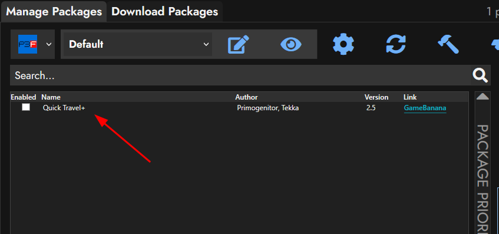
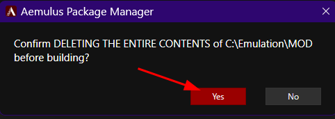

Installing Mods
===============

|     There are two methods for installing Aemulus packages, and it will
  be important for you to know both of them. Some mods like Simply
  Better FMVs are too large for Gamebanana that using the one-click
  option isn’t possible. For your convenience, a `collection of
  mods <https://gamebanana.com/tuts/15959#H1_0>`__ is included at the
  beginning of this guide, and are recommended in conjunction with
  Persona 3 FES HD Overhaul.

.. note::
   These install methods also work with Linux.

One-Click Method
----------------

|     This is the easiest way to install mods. Find a mod you want to
  download. In this example we’re going to use Quick Travel+

-  1.    Navigate to the mod page on Gamebanana.
-  2.    Scroll down to the **"Files"** section
-  3.    Click the big **"Aemulus Package Manager 1-CLICK INSTALL"**
   link

| 
| |image88|

-  4.    Aemulus should open up and ask if you want to install, click
   **"Yes."**

| 
| |image89|

-  5.    After it downloads, it’ll auto add the mod to your list

| 
| |image90|

-  6.    Lastly, click the checkbox to enable the mod.

| 
| |image91|

-  7.    Rinse and repeat for any other mods you want to add.

| 

Manual Method
-------------

|     This is technically the harder way of installing a mod, as it
  requires an extra step, but is required for large mods like Simply
  Better FMVs, or for some mods that don’t provide all of their files as
  a GameBanana download, like tiny tweaks. We’ll use Simply Better FMVs
  as an example here.

-  1.    Navigate to the mod page on the GameBanana website. In this
   case it will be Simply Better FMVs.
-  2.    Scroll down until you get to the **"Files"** section
-  3.    Click **"Download"** if you’re wanting to download a package
   that is hosted by GameBanana, or click the name of an Alternate File
   Source, in the example picture we’ll use **"SBFMV English Classic
   Subs."**

| 
| |image92|

-  4.    If the file is on GameBanana, it will auto-start the download,
   if the file is on google drive it’ll take you to a preview page which
   will give you a link to click **"Download"**. If the file is too
   large, it’ll take you to another page that says it couldn’t scan for
   viruses. You’ll want to click **"Download anyway."**

| 
| |image93|
| |image94|

-  5.    Once your download completes, open file explorer and navigate
   to your downloads folder (You can access it from Quick Access at the
   left), then drag and drop the file onto the Aemulus window to install
   it.

| 
| |image95|
| |image96|
| |image97|

-  6.    If the file is large, Aemulus may lock up for a moment while it
   processes the archive. Be patient. Once it’s installed it will be
   automatically added to your list.

| 
| |image98|

-  7.    Lastly, click the checkbox to enable the mod.

| 
| |image99|

-  8.    Rinse and repeat for any other mods you want to add.

| 

Aemulus Mod Priorties
---------------------

|     Certain mods in Aemulus need to be in a specific order. The mods
  are added to the recommended collections in the order they should be
  in in aemulus, reading from left to right, then top to bottom. In
  order to change the mod priority, you can simply drag and drop a
  package to move it up or down the list. If a mod provides any add-ons,
  they’ll usually go above the base mod, be sure to check the individual
  mod page for information regarding this.

Building your mods
------------------

| 

-  1.    Once you’re happy with the mods you’ve installed. Click the
   hammer at the top right.

| 
| |image100|

-  2.    Aemulus will confirm if you want to delete the contents of your
   output directory. Click **"Yes."**

| 
| |image101|

-  3.    A bunch of stuff will show up in the log below, let it run.
   Aemulus may appear to be unresponsive at times, just be patient.

| 
| |image102|

-  4.    Once done, Aemulus will say **“Finished Building!”** Click
   **"OK"** and you’re done with Aemulus until the next time you want to
   add/change/update mods. Feel free to close it out until you need it
   again.

| 
| |image103|

