Installing Persona 3 FES: HD Overhaul
=====================================

| 
| (If you don’t want to use this mod, you can skip this step.)

-  1.    Open up the Persona 3 FES HD Overhaul 7z file, either by double
   clicking, or right click, hover over **"7-Zip"**, and **"Open
   archive."**

-  a.    In the 7-zip file manager, navigate to the following. Each
   folder is opened with a double click. **"Persona 3 FES HD Overhaul"**
   > **"Base Mod"** > **"PCSX2 DIR"**

| 
| |image32|
| |image33|
| |image34|

-  b.    Inside the folder you will have one folder named
   **"textures."** Drag and drop that into your PCSX2 directory that you
   should still have open from earlier.

| 
| |image35|
| It will look like this if you’ve done it right.
| |image36|

-  c.    **Optional:** Click the up button in 7-Zip File Manager twice
   to get back to the folder that has **"Base Mod"** / **"Extras"**

| 
| |image37|
| |image38|
| Navigate into the **"Extras"** folder.
| |image39|
| For each extra you want, double click the folder, then double click
  **"PCSX2 DIR"**, then copy over textures into PCSX2 like you did
  earlier. This time you’ll be asked if you want to overwrite files, be
  sure to click **"Replace the files in the destination."**
| |image40|
| |image41|
| Then press the up arrow twice to get back to the extras folder and
  repeat for any other extras you want
| |image42|

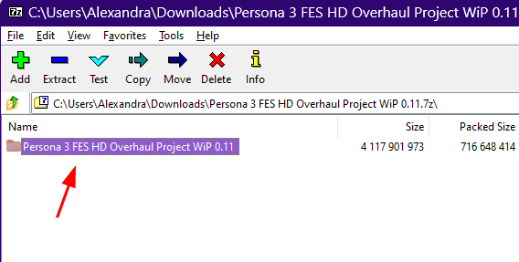
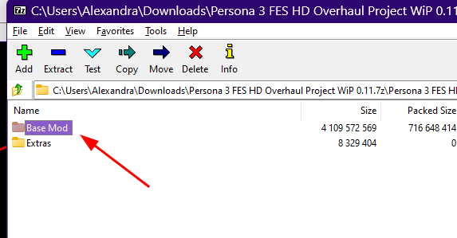
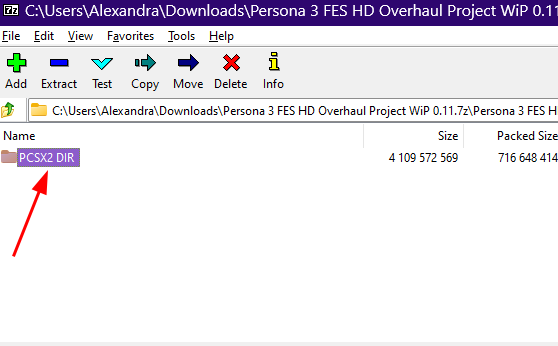
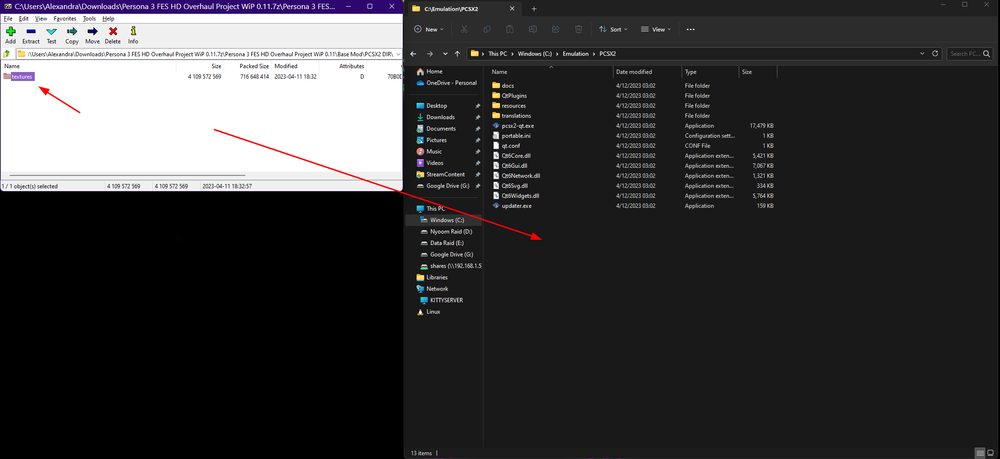
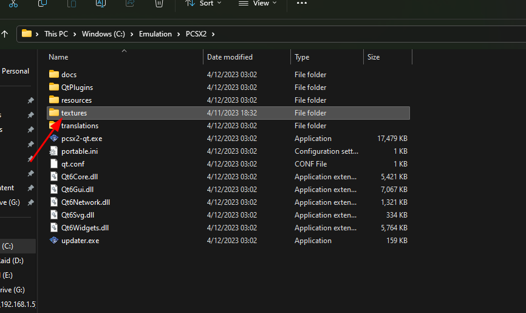
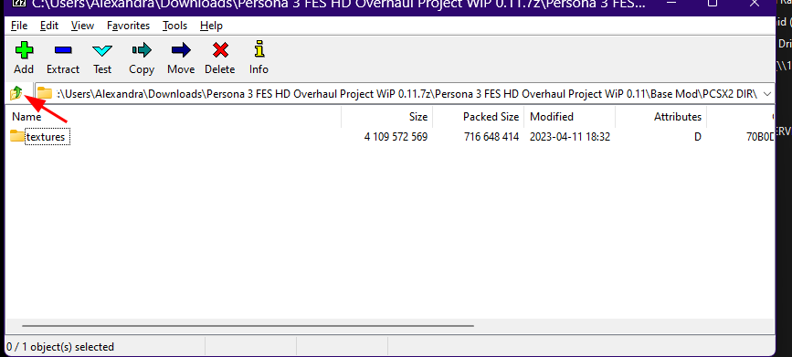
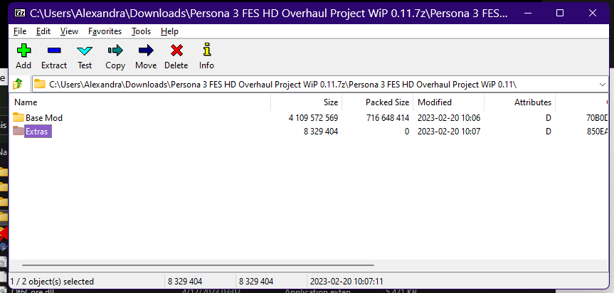
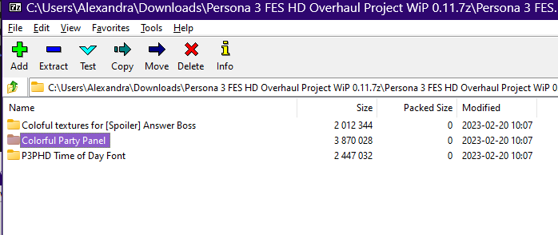
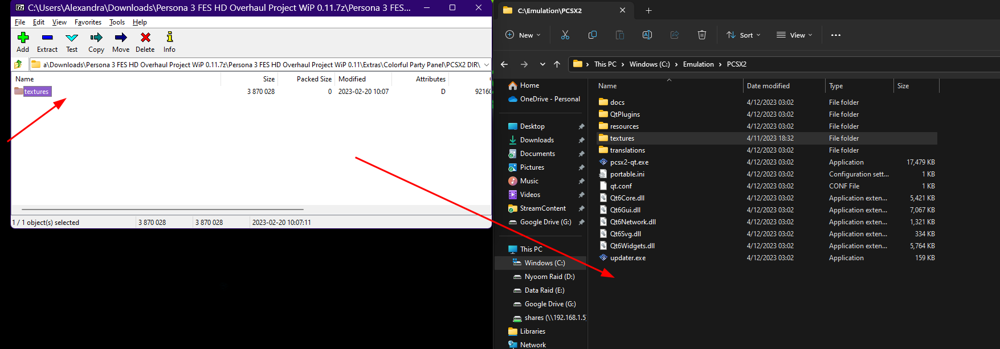
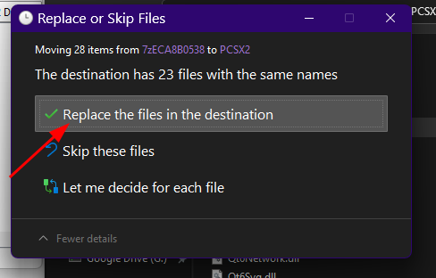
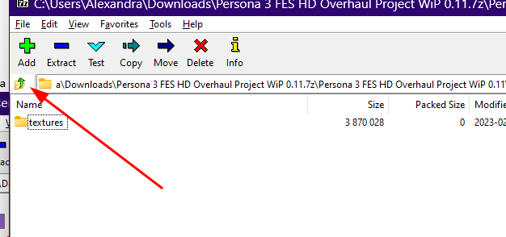
