Installing 7-Zip, PCSX2, and Aemulus
=====================================

-  1.    Setup a folder that is outside your user profile.
   Recommendation is to use something like C:\\Emulation or C:\\Persona,
   whichever is more convenient for you.

-  a.    Open up windows file explorer, click **“This PC”** (In other
   languages this will be named different, in Japanese it’s just
   **“PC”**)
-  b.    Navigate to your **"C:\\"** Drive (or whichever other drive you
   want to set this up at)
-  c.    Right click an empty space, hover over **"New"**, then click
   folder
-  d.    Name the folder Persona, or Emulation, or whatever else will
   make it easy to identify for you.

| 
| |image6|
| |image7|
| |image8|

-  2.    Install 7-Zip, you should have the following files in your
   downloads folder. Open up a new file explorer window (Ctrl+N in the
   previous window will work for this) and navigate to **"Downloads"**
   using the quick access bar at the left

| 
| |image9|

-  a.    Double click the 7z exe file, the icon will be black and white,
   and then follow the prompts to install.

| 

-  3.    Extract the contents of each of the packages we downloaded
   earlier. If 7zip is associated as the default file handler for 7z
   files, you should be able to double click them to open them up. If it
   is not and the icon shows as a blank white file icon instead, you
   will need to right click, hover over **"7-Zip"**, then click **"Open
   archive."**

| 
| |image10|

-  a.    Open up the Aemulus 7-zip package, and drag and drop the
   contents into your C:\\Emulation folder.

| 
| |image11|

-  b.    A few popups will come up during the extraction process,
   followed by a final explorer copy pop up. Let these do their thing,
   do not interrupt them or hit cancel.

| 
| |image12|

-  c.    Make a folder for PCSX2 in your C:\\Emulation folder by right
   clicking an empty area, hovering over **"New"**, and clicking
   **"Folder."** Then open up the newly made PCSX2 folder

| 
| |image13|
| |image14|
| Be sure to name it PCSX2 (or anything else you want so you can
  identify it easily.)

-  d.    Make another folder called ROM (this is where your Persona 3
   FES.iso will go) using the same steps as above.
-  e.    Make one last folder called MOD (this is where your ELF will go
   along with your Aemulus mod files using the same steps as above.)

| 
| |image15|
| If done right your Emulation folder will look like this.

-  f.    Copy over your `legally obtained <https://p3f.cep.one/install/dump-p3f-iso>` Persona 3 FES.iso into the ROM
   folder now.

| 
| |image16|
| The contents of the ROM folder should look like this

-  g.    Next we’re going to grab the ELF file. Right click your Persona
   3 FES iso file, hover over **"7-Zip"**, click **"Open archive."**

| 
| |image17|

-  h.    Navigate back to your Emulation folder by clicking Emulation in
   your address bar, then double click MOD to open it.

| 
| |image18|
| |image19|

-  i.    In 7-Zip File Manager, select the **"SLUS_216.21"** file, then
   drag and drop it into your MOD folder.

| 
| |image20|
| |image21|
| |image22|

-  j.    Rename your **"SLUS_216.21"** file to something like Persona 3
   FES.ELF or whatever else you want it to be called, as long as it ends
   in .ELF. Right click the file, then click Rename. Then type the name
   Persona 3 FES.ELF then hit enter. Finally it’ll give you a prompt
   asking if you want to change the file extension. Click **"Yes."**
| 
| "Um, Miss Kitty, CEP says you shouldn't rename the ELF." That's cool,
  don't do it if you don't want to - just tack .ELF to the end of the
  file, it makes no difference other than making your Discord Rich
  Presence not look stupid in PCSX2 if you choose to enable that, and
  also makes the game recognizable in your PCSX2 game list.
| |image23|
| |image24|
| |image25|
| |image26|
| Once done it’ll look like this.

-  k.    Navigate back to your C:\\Emulation folder by clicking
   **"Emulation"** in the address bar at the top.

| 
| |image27|

-  l.    Open up the PCSX2 7z file in your downloads folder in 7-zip,
   either by double clicking or right click, hover over **"7-Zip"**,
   then click **"Open Archive."**
-  m.    Select all files in the 7-Zip file manager (Ctrl-A is the
   easiest way to do this). Then drag the contents into the PCSX2
   folder.

| 
| |image28|
| |image29|

-  n.    Open **"pcsx2-qt.exe"** once to populate all of your files.

| 
| |image30|
| Once opened your folder will look like this
| |image31|

-  o.    Copy over your `legally obtained <https://p3f.cep.one/install/dump-ps2-bios>` bios into the bios folder.
   We’ll cover making sure your BIOS is in pcsx2 correctly later. For
   now, go ahead and close pcsx2.

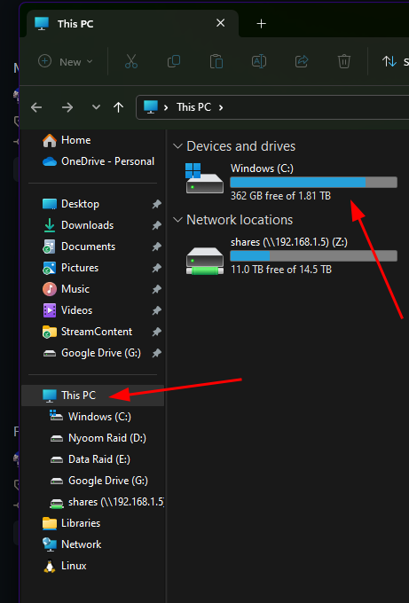
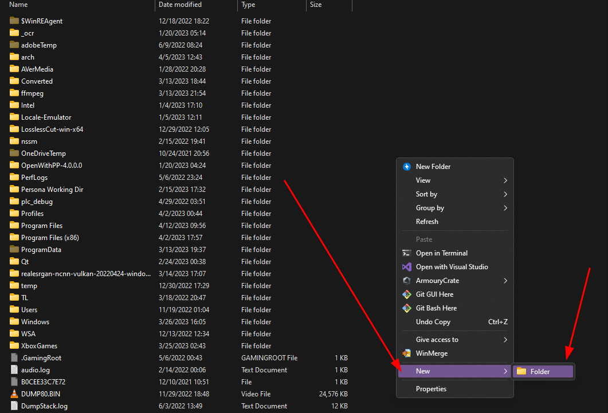
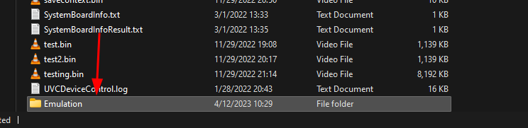
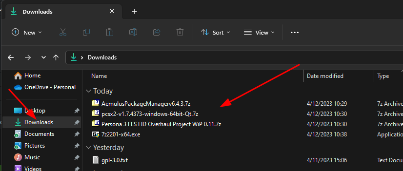
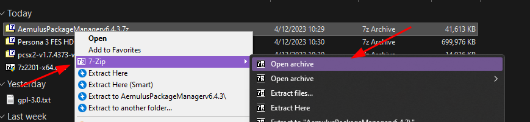
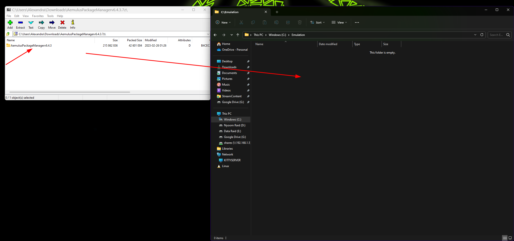
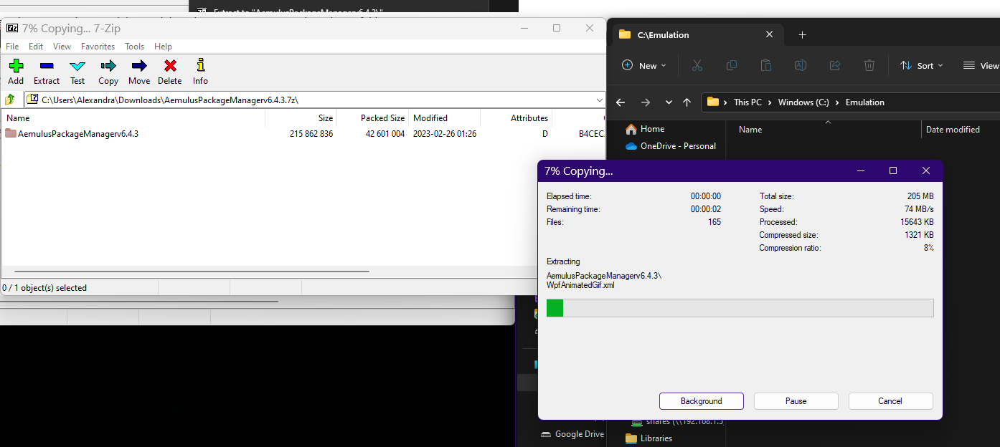
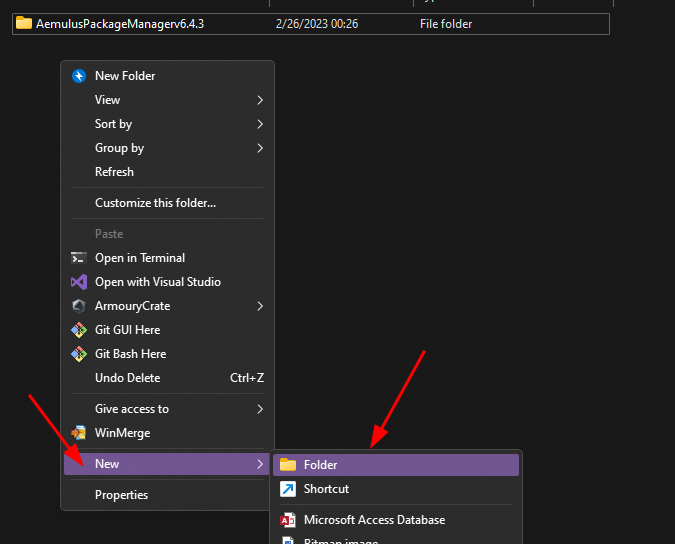
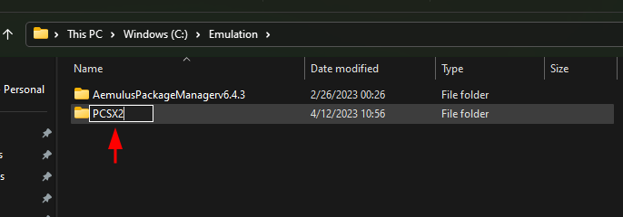
.. |image15| image:: images/15.png
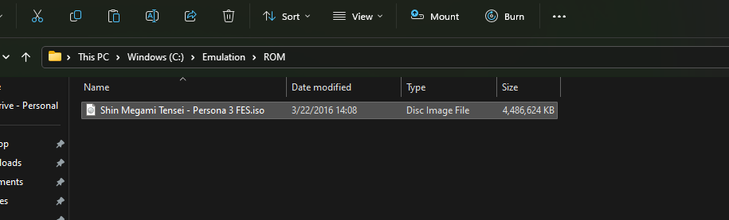
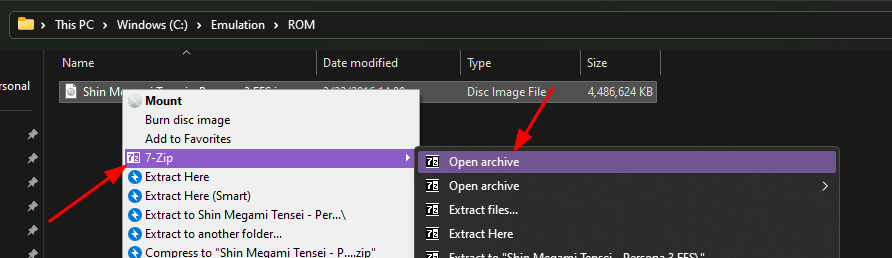
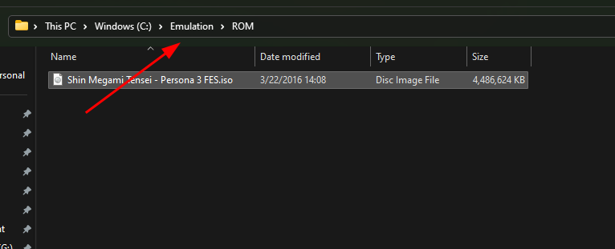
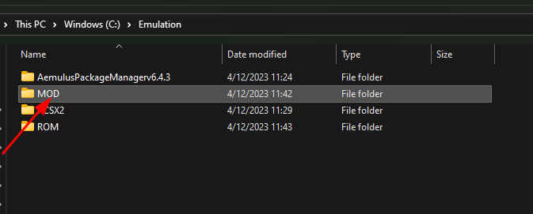
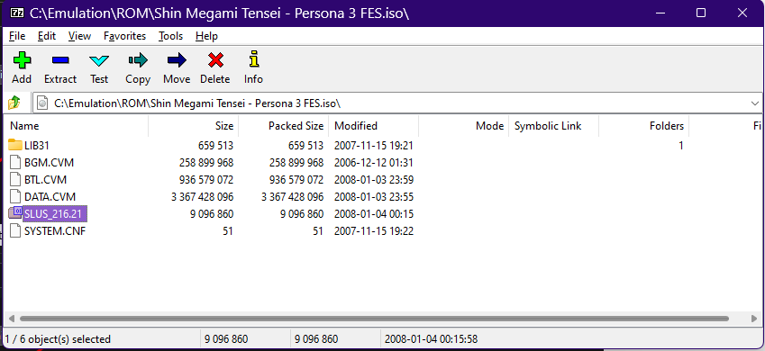
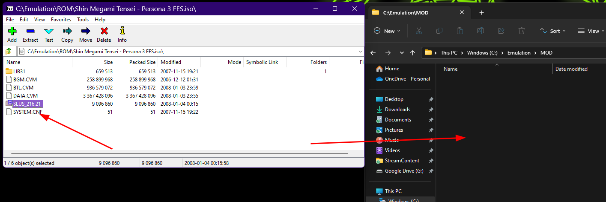
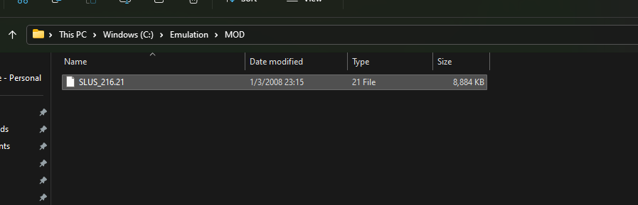
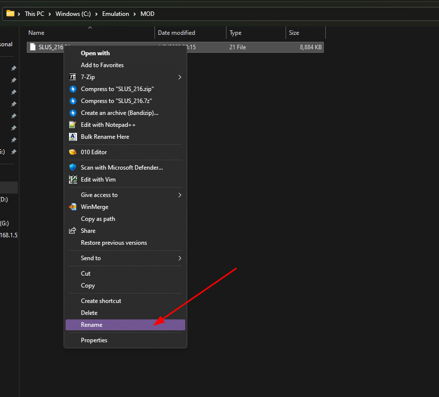
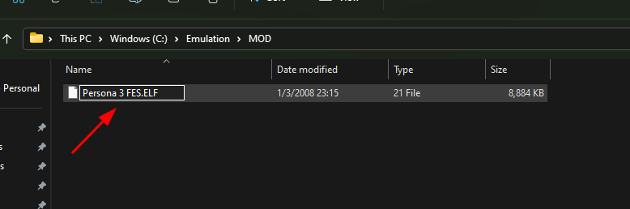
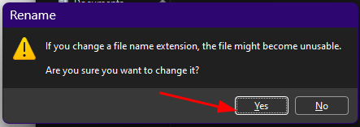
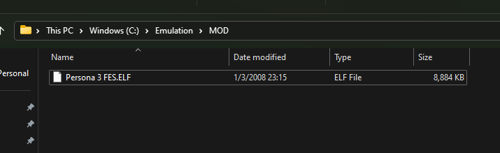
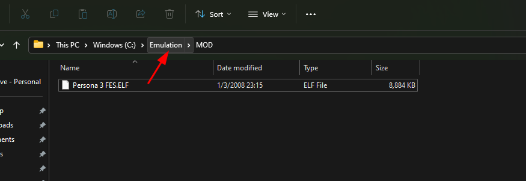
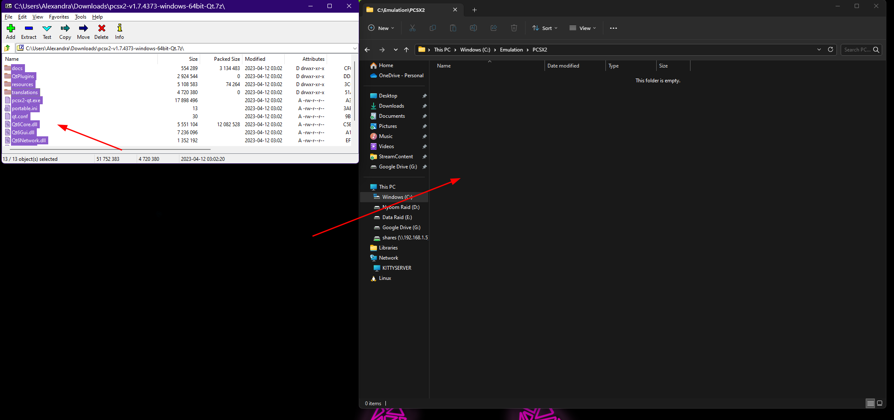
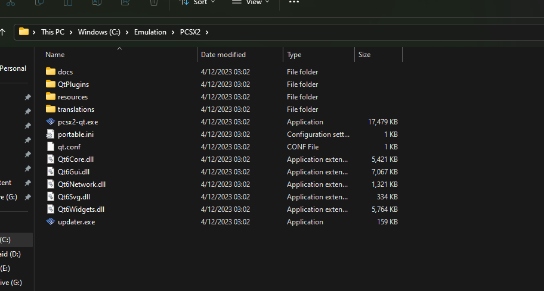
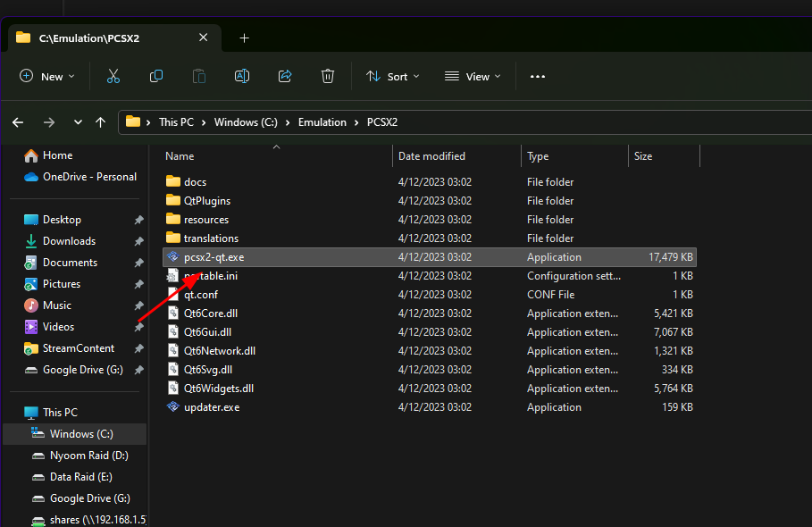
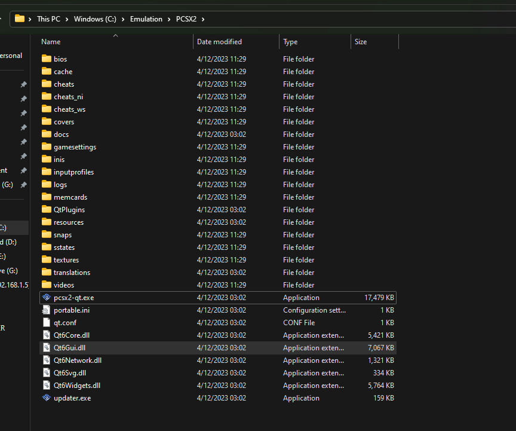
